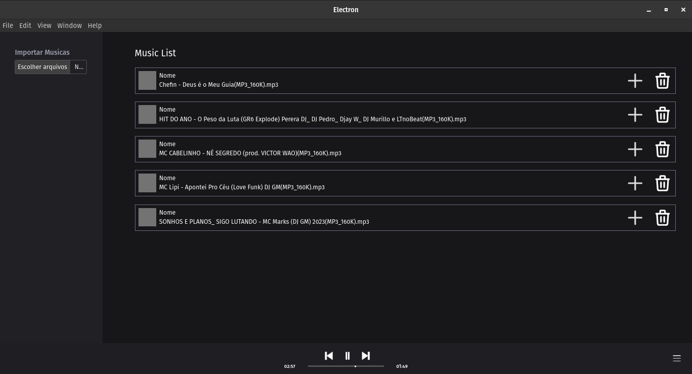

#   Emusic

Essa aplicação foi desenvolvida durante o curso Full Stack JavaScript da onebitcode utilizando React, Next, Electron, Postcss, JavaScript e tailwindcss.

## Executando

Após clonar o repositório, acesse a pasta do projeto e execute os comandos abaixo:

```sh
npm install
npm run dev
```

Acesse http://localhost:3000 para visualizar a aplicação.
